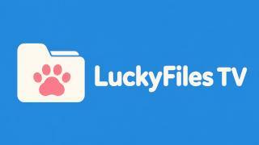
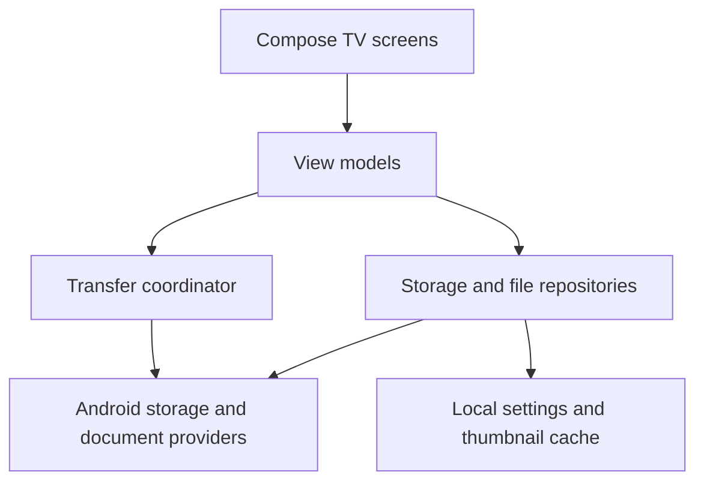

<p align="center">
  
</p>

<p align="center">
  <strong>A remote friendly file manager for Android TV</strong>
</p>

<p align="center">
  
  
  
  
  <a href="LICENSE"></a>
</p>

LuckyFiles TV is built for the television instead of adapting a touch interface to a large screen. Navigation, focus handling and dialogs are designed around a directional pad, with the common file operations available without a mouse or keyboard.

<table>
  <tr>
    <td width="50%">
      <strong>Browse and search</strong><br>
      Navigate local and connected storage sources, search for files and access recently used documents.
    </td>
    <td width="50%">
      <strong>Manage files</strong><br>
      Copy, move, rename and delete files or folders. Multiple selections and name conflicts are handled directly in the TV interface.
    </td>
  </tr>
  <tr>
    <td width="50%">
      <strong>Preview content</strong><br>
      Display previews for images, videos, PDF files and audio files. Folder artwork can be loaded from <code>folder.jpg</code>.
    </td>
    <td width="50%">
      <strong>Choose your layout</strong><br>
      Sort by name, date, size or file type, keep folders at the top and clean up release style file names for easier reading.
    </td>
  </tr>
</table>

## TV first navigation

LuckyFiles TV uses Jetpack Compose for TV and keeps focus behavior predictable across the file grid, menus and dialogs. Every main action can be reached with a standard remote control.

The interface is available in English and German. Language, folder artwork, file name cleanup and sorting can be adjusted in the app settings.

## File previews

Images, PDF documents, audio files and supported videos receive thumbnails in the browser. Video frames are generated with Android platform APIs, so the exact codec support depends on the Android TV device.

Generated previews are cached to keep browsing responsive. If a format cannot be decoded, the regular file type icon is shown instead.

## Architecture

The app follows a small layered structure. Compose screens render state and forward user actions. View models coordinate navigation, settings and transfers. Repositories and transfer components perform file system work away from the main thread.



| Area | Responsibility |
| :--- | :--- |
| UI | TV layouts, directional pad focus, dialogs and user actions |
| View models | Screen state, navigation, lifecycle aware work and UI events |
| Repositories | Storage discovery, directory contents, file metadata, settings and previews |
| Transfer layer | Copy and move operations, conflict decisions, progress and recovery |
| Providers | File sharing and Android document provider integration |

## Document access

The project includes Android document provider support and a document picker made for TV screens. The optional system picker integration is disabled in regular builds. It can be enabled with the resource overlay in `src/system` for installations that have the required system privileges.

## Storage permission

`MANAGE_EXTERNAL_STORAGE` gives LuckyFiles TV broad access to shared storage. A full file manager needs this permission to browse arbitrary folders and to copy, move, rename or delete files outside its own app directory. The narrower media and document permissions are not sufficient for these operations across the complete file system.

Android does not grant this access automatically. The user must enable all files access for LuckyFiles TV in the system settings. The app should only use this access for file operations initiated through its interface.

The optional system document picker is separate. It requires system level `MANAGE_DOCUMENTS` access and is intended for trusted system builds, not a normal application installation.

## Privacy

LuckyFiles TV processes files on the device. The current app manifest does not request internet access, and the source does not include analytics, advertising, tracking or crash reporting services.

| Data | Handling |
| :--- | :--- |
| Files and folders | Read or changed locally when the user browses or starts a file operation |
| File metadata | Read locally to display names, types, sizes, dates and properties |
| App settings | Stored locally with Android DataStore |
| Generated thumbnails | Stored in the app cache and removable through Android system settings |
| Personal data transmission | No transmission is implemented by the app |

Opening a file in another app or using a document provider hands the selected content to that external app or provider. Its own privacy policy and behavior then apply. Removing app data clears LuckyFiles TV settings and cached previews, but does not delete the user's files.

## Building

Open the complete project in Android Studio and let Gradle finish syncing. The app can then be run on an Android TV device or emulator.

To create a debug APK from the project root:

```bash
./gradlew assembleDebug
```

## Project structure

| Path | Contents |
| :--- | :--- |
| `src/main/java` | Kotlin application code |
| `src/main/res` | App resources, translations, icons and TV banner |
| `src/system` | Resource overlay for the optional system document picker |

## Contributing

Bug reports and focused pull requests are welcome. A useful bug report includes the Android version, device model, storage source and the steps needed to reproduce the problem.

## License

LuckyFiles TV is available under the [MIT License](LICENSE).
